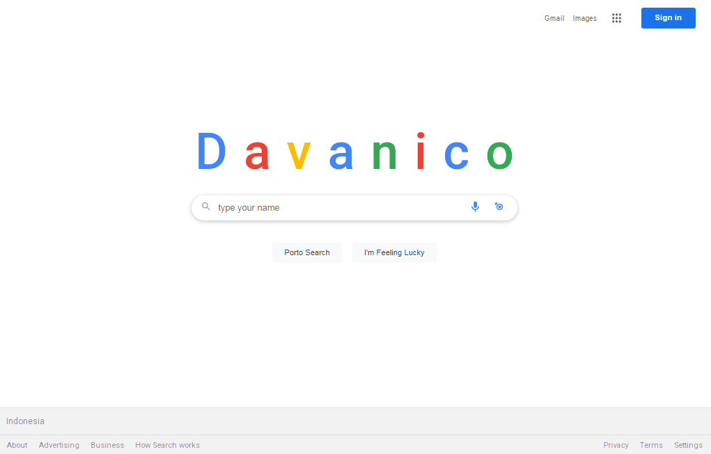
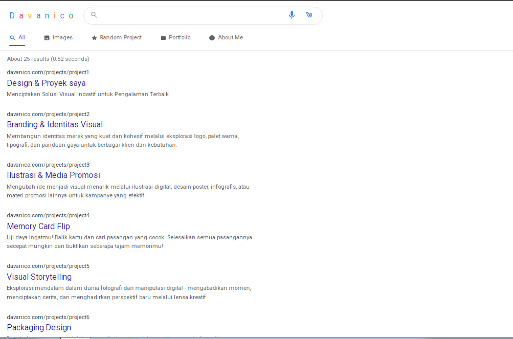

# davanikoo.me — Personal Website

A high-performance, minimalist, Google-style personal website built with simplicity and speed in mind.

This site is designed to load fast, stay distraction-free, and highlight the essentials of my work and profile.

 **Live site:** [https://davanikoo.me](https://davanikoo.me)

---

##  Features

-  100/100 Performance (Lighthouse)
-  SEO optimized
-  Fully responsive
-  Clean, Google-inspired UI
-  Built with modern frontend tools

---

##  Preview

---
##  Preview

---

##  License & Anti-Cloning Policy

This repository is **NOT open-source**.

 You are **NOT allowed to**:
- Clone or fork this repository
- Reuse the layout, code, or structure
- Host any derived version of this website

 You **may**:
- View the public code strictly for personal learning
- Ask permission if you want to reuse any part

> This site is protected by a custom copyright license.  
> Legal action (including DMCA takedown) may be taken if violations occur.

© 2025 Davanico  
 Contact: hi@davanikoo.me

---

##  Credits

Everything is built from scratch. No templates or site builders were used.
